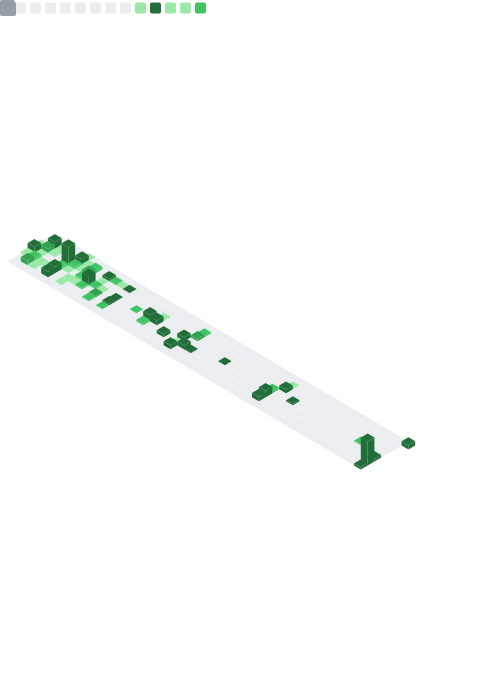
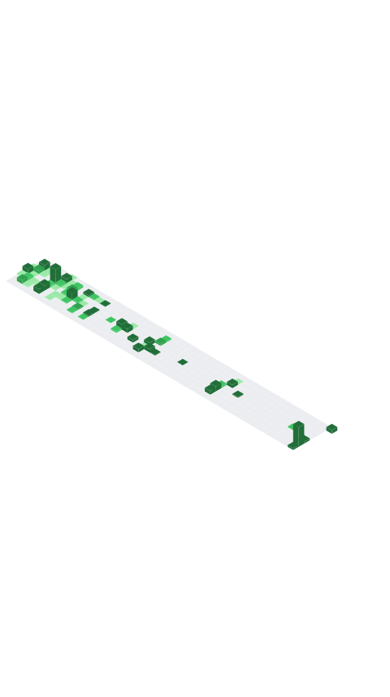
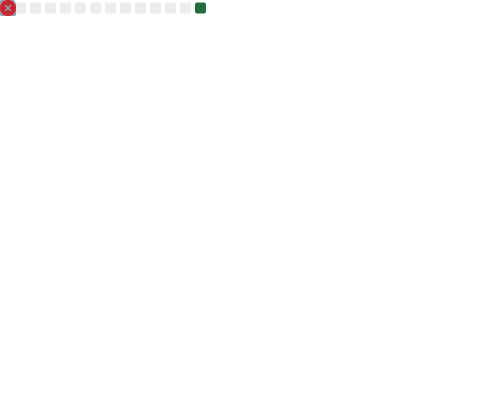
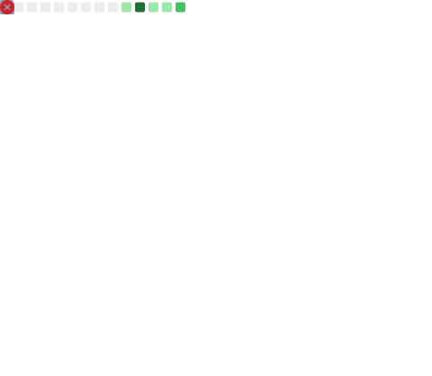

<!-- ════════════════════════════════════════════════════════════════
                          HERO / BANNER
═════════════════════════════════════════════════════════════════ -->

<a href="https://github.com/mchittineni">
  
</a>

<p align="center">
  
</p>

<p align="center">
  <a href="https://linkedin.com/in/manideep.chittineni"></a>
  <a href="mailto:manideep.chittineni@hotmail.com"></a>
  <a href="https://d1b15k9mvnc6aj.cloudfront.net/"></a>
  <a href="https://github.com/mchittineni"></a>
</p>

<p align="center">
  
  
  
  
</p>

<!-- ════════════════════════════════════════════════════════════════
                         PROFESSIONAL SUMMARY
═════════════════════════════════════════════════════════════════ -->

## 🧭 Professional Summary

> **Cloud, DevOps, and AI Engineer with 6+ years** designing, building, securing, and operating
> scalable cloud-native and hybrid infrastructure across **Azure, AWS, and GCP** now extending that
> foundation into **production GenAI and agentic-AI engineering**.

Currently engineering the cloud-native infrastructure underpinning a **Speckle-based design ecosystem**
and a **Databricks data platform**, integrating data-engineering workflows into the broader ecosystem.
Deep, hands-on expertise in **Infrastructure as Code** (advanced, modular Terraform with remote state),
**Kubernetes**, and YAML-driven pipeline design combined with **DevSecOps** (Zero Trust, least-privilege
IAM, policy-as-code, secrets management, GDPR / SOC 2) and solid **SRE + FinOps** discipline focused on
reliability, observability, and cost optimisation.

Formally trained as an **AI engineer through Anthropic and OpenAI certification tracks**, shipping
**LLM-powered applications, agents, subagents, and agent skills**, building on the **Model Context Protocol**,
and deploying **Claude on Amazon Bedrock and Google Cloud Vertex AI** applying the same IaC, CI/CD,
security, and FinOps controls used for platform engineering.

<!-- ════════════════════════════════════════════════════════════════
                            ABOUT ME
═════════════════════════════════════════════════════════════════ -->

## 🙋 About Me

```yaml
name: Manideep Chittineni
role: Cloud · DevOps · AI Engineer
experience: 6+ years
now_building:
  - Cloud-native infra for a Speckle-based design ecosystem (AWS + GCP)
  - Databricks data platform — Unity Catalog, cluster policies, job orchestration
  - GenAI & agentic-AI tooling on Bedrock & Vertex AI under platform governance
clouds: [AWS, Azure, GCP, OCI]
ask_me_about: [Platform Engineering, IaC, Kubernetes, DevSecOps, SRE, FinOps, GenAI, MCP]
mindset: AI-fluency + deep platform engineering = secure, governed, cost-aware AI systems
```

<!-- ════════════════════════════════════════════════════════════════
                       AI & GENAI ENGINEERING
═════════════════════════════════════════════════════════════════ -->

## 🤖 AI &amp; GenAI Engineering

<table>
  <tr>
    <td width="50%" valign="top">
      <b>🧠 LLM Application Development</b><br>
      <sub>Claude API &amp; OpenAI APIs, Claude Code, prompt engineering, tool/function calling, structured outputs, evaluation &amp; RAG patterns</sub>
    </td>
    <td width="50%" valign="top">
      <b>🕹️ Agentic AI</b><br>
      <sub>Agents, subagents &amp; agent skills; multi-step agentic workflows &amp; orchestration; reliable tool-using autonomous systems</sub>
    </td>
  </tr>
  <tr>
    <td width="50%" valign="top">
      <b>🔌 Model Context Protocol (MCP)</b><br>
      <sub>MCP foundations &amp; advanced topics; building/integrating MCP servers &amp; clients to connect LLMs with enterprise tools and data</sub>
    </td>
    <td width="50%" valign="top">
      <b>☁️ LLMOps &amp; Cloud AI Platforms</b><br>
      <sub>Claude on Amazon Bedrock &amp; Google Cloud Vertex AI same IaC, CI/CD, security &amp; FinOps discipline as platform engineering</sub>
    </td>
  </tr>
  <tr>
    <td colspan="2" valign="top">
      <b>🛡️ Responsible &amp; Applied AI</b><br>
      <sub>AI capabilities &amp; limitations, AI Fluency frameworks, and driving safe, governed AI adoption across education, nonprofit, and small-business contexts</sub>
    </td>
  </tr>
</table>

<!-- ════════════════════════════════════════════════════════════════
                           TECH STACK
═════════════════════════════════════════════════════════════════ -->

## 🧰 Tech Stack

<table align="center">
  <tr>
    <td align="center"><b>☁️&nbsp; Cloud</b></td>
    <td></td>
  </tr>
  <tr>
    <td align="center"><b>🤖&nbsp; AI &amp; GenAI</b></td>
    <td>
      
      
      
      
      
      
      
    </td>
  </tr>
  <tr>
    <td align="center"><b>🚢&nbsp; Containers &amp; Orchestration</b></td>
    <td></td>
  </tr>
  <tr>
    <td align="center"><b>⚙️&nbsp; Infrastructure as Code</b></td>
    <td>
      
      
      
      
      
    </td>
  </tr>
  <tr>
    <td align="center"><b>🔁&nbsp; CI/CD &amp; Config Mgmt</b></td>
    <td></td>
  </tr>
  <tr>
    <td align="center"><b>📈&nbsp; Observability</b></td>
    <td>
      
      
      
    </td>
  </tr>
  <tr>
    <td align="center"><b>🛡️&nbsp; Security &amp; DevSecOps</b></td>
    <td>
      
      
      
      
      
      
    </td>
  </tr>
  <tr>
    <td align="center"><b>🗄️&nbsp; Data Platforms</b></td>
    <td>
      
      
      
      
    </td>
  </tr>
  <tr>
    <td align="center"><b>💻&nbsp; Languages</b></td>
    <td></td>
  </tr>
</table>

<!-- ════════════════════════════════════════════════════════════════
                          EXPERIENCE
═════════════════════════════════════════════════════════════════ -->

## 💼 Experience

<table>
  <tr>
    <td valign="top" width="50%">
      <b>☁️ Cloud Engineer</b> — <i>Infoplus Technologies</i><br>
      <sub>Borehamwood, UK · Mar 2026 – Present</sub>
      <ul>
        <li>Cloud-native infra (AWS + GCP) for a Speckle ecosystem &amp; Databricks platform provisioning <b>3 days → &lt;2 hours</b>.</li>
        <li>Modular Terraform framework, <b>25+ reusable modules</b> w/ remote state <b>100%</b> repeatable deploys, drift <b>−70%</b>.</li>
        <li>Managed Kubernetes on GCP at <b>99.9%</b> availability; autoscaling cut idle compute <b>−25%</b>.</li>
        <li>Prototyped GenAI/agentic-AI in platform tooling (Claude API, OpenAI, MCP) manual toil <b>−30%</b>.</li>
        <li>LLMOps on Bedrock &amp; Vertex AI reusing IaC/CI-CD/identity/FinOps <b>zero new security findings</b>.</li>
      </ul>
    </td>
    <td valign="top" width="50%">
      <b>🎓 Senior Cloud &amp; DevOps Engineer</b> — <i>University of Exeter</i><br>
      <sub>Exeter, UK · Oct 2022 – Dec 2025</sub>
      <ul>
        <li>Hybrid + AWS platforms supporting <b>50,000+ users</b> at <b>99.99%</b> uptime.</li>
        <li>Serverless architectures (Lambda, API GW, SNS/SQS, DynamoDB) + multi-account governance (Orgs, Control Tower, SCPs).</li>
        <li>Zero Trust least-privilege IAM, federated identity (SSO/OIDC, RBAC/ABAC); Secrets Manager + KMS rotation.</li>
        <li>Security Hub, GuardDuty, Config aligned to GDPR / SOC 2 incident response <b>−50%</b>.</li>
        <li>FinOps (RIs, Spot, autoscaling, rightsizing) cut spend <b>−45%</b>; mentored <b>5+</b> engineers.</li>
      </ul>
    </td>
  </tr>
  <tr>
    <td valign="top" width="50%">
      <b>🛠️ DevOps / Platform Engineer</b> — <i>Procadence Technologies</i><br>
      <sub>Brentford, UK · Apr 2021 – Sep 2022</sub>
      <ul>
        <li>GKE clusters running <b>200+ microservices</b> for <b>15+ teams</b> at <b>99.9%</b> uptime; utilisation <b>+30%</b>.</li>
        <li>Reusable Terraform IaC for IAM &amp; governance drift &amp; manual effort <b>−60%</b>.</li>
        <li>Keyless CI/CD via Workload Identity Federation eliminated <b>100%</b> of long-lived SA keys.</li>
        <li>Multi-tenant isolation (namespaces, RBAC, IAM Conditions) + Zero Trust via IAP <b>zero</b> cross-tenant incidents.</li>
      </ul>
    </td>
    <td valign="top" width="50%">
      <b>👨‍💻 Software Engineer Intern</b> — <i>Procadence Technologies</i><br>
      <sub>Brentford, UK · Jun 2020 – Mar 2021</sub>
      <ul>
        <li>Automated Azure provisioning (ARM) across <b>150+ subscriptions</b> manual effort <b>−45%</b>.</li>
        <li>Azure DevOps CI/CD with automated testing &amp; secure deploys release effort <b>−35%</b>.</li>
        <li>Centralised secrets via Key Vault; Entra ID RBAC &amp; service principals at scale.</li>
        <li>Zero Trust via Azure Policy, Management Groups &amp; Conditional Access (MFA + device compliance).</li>
      </ul>
    </td>
  </tr>
</table>

<!-- ════════════════════════════════════════════════════════════════
                         FEATURED PROJECTS
═════════════════════════════════════════════════════════════════ -->

## 📦 Featured Work

<table align="center">
  <tr>
    <td align="center" width="25%">
      <br>
      <b>Modular Terraform Framework</b>
      <br><sub>25+ modules · AWS + GCP · remote state · 100% repeatable</sub>
    </td>
    <td align="center" width="25%">
      <br>
      <b>Speckle on GKE</b>
      <br><sub>Managed K8s · autoscaling · 99.9% availability</sub>
    </td>
    <td align="center" width="25%">
      <br>
      <b>Databricks Data Platform</b>
      <br><sub>Unity Catalog · cluster policies · job orchestration</sub>
    </td>
    <td align="center" width="25%">
      <br>
      <b>Agentic Platform Tooling</b>
      <br><sub>Claude API · OpenAI · MCP · Bedrock + Vertex AI</sub>
    </td>
  </tr>
</table>

<!-- ════════════════════════════════════════════════════════════════
                          GITHUB ACTIVITY
═════════════════════════════════════════════════════════════════ -->

## 📊 GitHub Activity

<p align="center">
  
  
</p>

<p align="center">
  
</p>

<p align="center">
  
</p>

<p align="center">
  
</p>

<!-- ════════════════════════════════════════════════════════════════
                       CONTRIBUTION SNAKE
═════════════════════════════════════════════════════════════════ -->

<picture>
  <source media="(prefers-color-scheme: dark)" srcset="assets/snake/snake-dark.svg" />
  <source media="(prefers-color-scheme: light)" srcset="assets/snake/snake.svg" />
  
</picture>

<!-- ════════════════════════════════════════════════════════════════
                    CURATED METRICS (RELEVANT ONLY)
═════════════════════════════════════════════════════════════════ -->

## 🗓️ Contribution &amp; Coding Insights

<table align="center">
  <tr>
    <th align="center" width="50%">📅 Contribution Calendar</th>
    <th align="center" width="50%">🌟 Activity Overview</th>
  </tr>
  <tr>
    <td align="center"></td>
    <td align="center"></td>
  </tr>
  <tr>
    <th align="center">💡 Coding Habits</th>
    <th align="center">📈 Habit Facts</th>
  </tr>
  <tr>
    <td align="center"></td>
    <td align="center"></td>
  </tr>
</table>

<!-- ════════════════════════════════════════════════════════════════
                         CERTIFICATIONS
═════════════════════════════════════════════════════════════════ -->

## 🎓 Certifications

<table>
  <tr>
    <td valign="top" width="50%">
      <b>☁️ Cloud, Infrastructure &amp; Data</b>
      <ul>
        <li><a href="https://www.credly.com/badges/5f18e335-13fb-4ccc-994d-ed8e422a0f3b/linked_in_profile">AWS Solutions Architect – Associate</a></li>
        <li><a href="https://www.credential.net/b488aa0d-d156-499c-91a0-4132f12a97a2?key=b37942efb1541e72a4a40381246efedb424c60c551fa2b7b7baff5573d77948a#acc.5B3UOSQI">Google Cloud Associate Cloud Engineer</a></li>
        <li><a href="https://www.credly.com/badges/5b2e93b4-470a-4d8c-b4b7-3c0cbd10cd6a?source=linked_in_profile">Microsoft Azure Fundamentals – AZ-900</a></li>
        <li><a href="https://education.oracle.com/oracle-cloud-infrastructure-developer-2025-associate/pexam_1Z0-1084-25">OCI Developer – Associate</a></li>
        <li><a href="https://education.oracle.com/oracle-cloud-infrastructure-2025-architect-associate/pexam_1Z0-1072-25">OCI Cloud Operations / Architect – Associate</a></li>
        <li><a href="https://credentials.databricks.com/cd05f977-4ea2-420c-9b16-c35ee7014ba7">Databricks Fundamentals</a></li>        
        <li>HashiCorp Certified: Terraform Associate</li>
      </ul>
    </td>
    <td valign="top" width="50%">
      <b>🤖 AI &amp; Generative AI</b>
      <ul>
        <li><a href="https://www.credly.com/badges/fda35ffe-a6ba-473a-b5ae-48aebba457d8?source=linked_in_profile">Microsoft Azure AI Fundamentals – AI-900</a></li>
        <li>AWS Certified AI Practitioner</li>
        <li><a href="https://credentials.databricks.com/ca9b7009-20d4-4978-80da-40171a158536">Databricks Generative AI Fundamentals</a></li>
        <li>Claude &amp; Claude Code Fundamentals</li>
        <li><a href="https://verify.skilljar.com/c/r4k36wahspip">Building Applications with the Claude API</a></li>
        <li><a href="https://verify.skilljar.com/c/wcqfxigi33xe">Claude on Amazon Bedrock </a> &amp; <a href="https://verify.skilljar.com/c/set5z48k4io8">Google Cloud Vertex AI </a></li>
        <li>Model Context Protocol (MCP) – Foundations &amp; Advanced</li>
        <li>AI Agents, Subagents &amp; Agent Skills</li>
        <li>AI Capabilities &amp; Limitations · AI Fluency Frameworks</li>
        <li>OpenAI: AI Foundations · Applied AI Foundations · Agents &amp; Workflows</li>
      </ul>
    </td>
  </tr>
</table>

<sub>🟢 AWS Demonstrated: * <a href="https://www.credly.com/badges/7dc752e5-43ae-4ee7-bbfd-33631e412f16/linked_in_profile">Application Networking</a> * <a href="https://www.credly.com/badges/77b46116-d903-49b5-8e2c-e13a9f47472c/linked_in_profile">Incident Response</a> * <a href="https://www.credly.com/badges/20201dc6-9611-4c9f-8e38-43f448cca8c9">Serverless</a></sub>

<!-- ════════════════════════════════════════════════════════════════
                             FOOTER
═════════════════════════════════════════════════════════════════ -->

<br>

<p align="center">
  <i>🚀 Thanks for visiting let's build secure, governed, cost-aware systems.</i><br>
  <sub>Cloud · DevOps · AI · Platform Engineering · SRE · FinOps · DevSecOps</sub>
</p>


