### Hi there 👋

<table>
  <tr>
    <th align="center">🙋 Introduction</th>
    <th align="center">✨ Stargazers ✨</th>
  </tr>
  <tr>
        <td align="center">
        

          
About Me

          
Here are some things to know about me:

          <ul>
            <li>🔭 I’m currently working on Typescript & Python Projects</li>
            <li>🌱 I’m currently learning AWS (SAA-C03)</li>
            <li>👯 I’m looking to collaborate on AWS Projects</li>
            <li>🤔 I’m looking for help with New ways to do Automation</li>
            <li>💬 Ask me about AWS, Azure, GCP</li>
          </ul>
        

        
      </td>
        <td  align="center">
        

Full Year Stargazers
</img>

        

Monthly Stargazers
</img>

        
      </td>
  <tr>
    <th align="center">📅 commit calendar 📅</th>
    <th align="center">🈷️ Languages activity 🈷️</th>
  </tr>
  <tr>
        <td  align="center">
        

Full year calendar
</img>

        

Half year calendar
</img>

        
      </td>
        <td  align="center">
        

Indepth analysis
</img>

        

Recently used
</img>

        

Default algorithm
</img>

      </td>
  </tr>
  <tr>
    <th align="center">📌 Starred topics 📌</th>
    <th align="center">💡 Coding habits and activity 💡</th>
  </tr>
  <tr>
        <td  align="center">
        

With icons
</img>

        

With labels
</img>

        
      </td>
        <td  align="center">
        

Recent activity charts
</img>

        

Mildly interesting facts
</img>

        
      </td>
  </tr>
  <tr>
    <th align="center">🌟 Full Metrics 🌟</th>
    <th align="center">📆 Commit calendar 📆</th>
  </tr>
   <tr>
        <td align="center">
        </img>
      </td>
        <td  align="center">
        

Current year
</img>

        

Full history
</img>

        
      </td>
  </tr>
</table>