### Hi there 👋
DevOps Engineer specialising in AWS, GCP, and Azure with a focus on automation, IaC, and cloud-native platforms.

  
  
  
  
  
  
  

<table>
  <tr>
    <th align="center">🙋 Introduction</th>
    <th align="center">✨ Stargazers ✨</th>
  </tr>
  <tr>
    <td align="center">
      

        
About Me

        <ul>
          <li>🔭 DevOps Engineer (AWS, GCP, Azure)</li>
          <li>👯 Open to AWS & Automation Projects</li>
          <li>💬 Ask me about Cloud, DevOps, IaC</li>
        </ul>
      

      

        
Experience (Summary)

        <strong>DevOps Engineer — University of Exeter (Oct 2022 – Present)</strong>
        <ul>
          <li>100% AWS infrastructure as code with Terraform, eliminating config drift.</li>
          <li>GitHub Actions & CodePipeline CI/CD, cutting release time and errors.</li>
          <li>ECS/EKS + Docker with multi-region DR and CloudFront for high availability.</li>
          <li>DevSecOps with automated security scans for GDPR/SOC 2-ready pipelines.</li>
          <li>45% AWS cost reduction using Reserved/Spot instances and auto-scaling.</li>
        </ul>

        <strong>DevOps Engineer — Procadence Tech (Apr 2021 – Sep 2022)</strong>
        <ul>
          <li>GCP infra automated with Terraform & Deployment Manager, 60% faster setup.</li>
          <li>GKE-based microservices platform (200+ services) with 99.9% uptime.</li>
          <li>Cloud Build & Jenkins CI/CD, moving from weekly to daily deployments.</li>
          <li>85% resource efficiency gain via autoscaling and right-sizing.</li>
        </ul>

        <strong>Software Engineer Intern — Procadence Tech (2020 – 2021)</strong>
        <ul>
          <li>Azure infrastructure automated with ARM templates, 45% less manual work.</li>
          <li>Azure DevOps CI/CD improvements for faster, more reliable releases.</li>
          <li>~15% application performance uplift via code and infra tuning.</li>
        </ul>
      

      

        
Skills

        <ul>
          <li><strong>Languages:</strong> Python, Typescript, Bash, Java, JS</li>
          <li><strong>Cloud:</strong> AWS, Azure, GCP, Oracle</li>
          <li><strong>Containers:</strong> Docker, Kubernetes, Helm</li>
          <li><strong>IaC:</strong> Terraform, Terragrunt, Pulumi, ARM, CloudFormation</li>
          <li><strong>Monitoring:</strong> Datadog, CloudWatch, Grafana, Prometheus</li>
          <li><strong>CI/CD:</strong> GitHub Actions, Jenkins, GitLab, Bitbucket</li>
        </ul>
      

      

        
Certifications

        <ul>
          <li>AWS Solutions Architect – Associate</li>
          <li>AWS Developer – Associate</li>
          <li>AWS AI Practitioner</li>
          <li>GCP Associate Cloud Engineer</li>
          <li>Azure Fundamentals (AZ-900)</li>
          <li>Azure AI Fundamentals (AI-900)</li>
          <li>Oracle Cloud Developer Associate</li>
        </ul>
      

      
    </td>

    <td align="center">
      

Full Year Stargazers
</img>

      

Monthly Stargazers
</img>

      
    </td>
  </tr>

  <tr>
    <th align="center">📅 commit calendar 📅</th>
    <th align="center">🈷️ Languages activity 🈷️</th>
  </tr>
  <tr>
    <td align="center">
      

Full year calendar
</img>

      

Half year calendar
</img>

      
    </td>
    <td align="center">
      

Indepth analysis
</img>

      

Recently used
</img>

      

Default algorithm
</img>

    </td>
  </tr>

  <tr>
    <th align="center">📌 Starred topics 📌</th>
    <th align="center">💡 Coding habits and activity 💡</th>
  </tr>
  <tr>
    <td align="center">
      

With icons
</img>

      

With labels
</img>

      
    </td>
    <td align="center">
      

Recent activity charts
</img>

      

Mildly interesting facts
</img>

      
    </td>
  </tr>

  <tr>
    <th align="center">🌟 Full Metrics 🌟</th>
    <th align="center">📆 Commit calendar 📆</th>
  </tr>
  <tr>
    <td align="center"></img></td>
    <td align="center">
      

Current year
</img>

      

Full history
</img>

      
    </td>
  </tr>
</table>