### Hi there 👋

**mchittineni/mchittineni** is a ✨ _special_ ✨

Here are some things to know about me:
- 🔭 I’m currently working on Typescript & Python Projects
- 🌱 I’m currently learning AWS (SAA-C03)
- 👯 I’m looking to collaborate on AWS Projects
- 🤔 I’m looking for help with ...
- 💬 Ask me about AWS, Azure, GCP

<!-- 

 -->

<table>
  <tr>
    <th align="center">🌟 Full Metrics 🌟</th>
    <th align="center">✨ Stargazers ✨</th>
  </tr>
  <tr>
    <td align="center">
</img>
</td>
<td  align="center">
        

Full Year Stargazers
</img>

        

Monthly Stargazers
</img>

        
      </td>
  <tr>
    <th align="center">📅 commit calendar</th>
    <th align="center">🈷️ Languages activity</th>
  </tr>
  <tr>
        <td  align="center">
        

Full year calendar
</img>

        

Half year calendar
</img>

        
      </td>
        <td  align="center">
        

Indepth analysis
</img>

        

Recently used
</img>

        

Default algorithm
</img>

      </td>
  </tr>
</table>