<h1 align="center">👋 Welcome to My GitHub Profile</h1>

<!-- =======================================================
                    ✨ ANIMATED BANNER
======================================================= -->

  

  <b>Cloud | DevOps | Platform | Automation | SRE | FinOps | DevSecOps </b> 
  Automating infrastructure, deploying scalable and fault-tolerant cloud-native systems.

  

---

<!-- =======================================================
                    🧰 TECH STACK SECTION
======================================================= -->

## 🧰 Tech Stack

  

<!-- =======================================================
                        📦 PROJECTS GRID
======================================================= -->

## 📦 Featured Projects

  <table>
    <tr>
      <td align="center">
        <a href="#">
           
          <b>Kubernetes GitOps Platform</b>
        </a>
        
ArgoCD · Helm · Kustomize · Multi-Cluster

      </td>
      <td align="center">
        <a href="#">
           
          <b>Terraform AWS Infra Suite</b>
        </a>
        
VPC · EKS · RDS · Autoscaling

      </td>
      <td align="center">
        <a href="#">
           
          <b>Dockerized Microservices</b>
        </a>
        
API Gateway · Monitoring · CI/CD

      </td>
    </tr>
  </table>

---

<!-- =======================================================
                   🙋 ABOUT + CERTIFICATIONS
======================================================= -->

## 🙋 About Me

  
More about me

  <ul>
    <li>🔭 DevOps Engineer specializing in AWS, GCP, and Azure</li>
    <li>⚙️ Passionate about automation, Kubernetes, and cloud-native systems</li>
    <li>🚀 Love building scalable CI/CD pipelines</li>
    <li>💬 Ask me about DevOps, Cloud, IaC, SRE</li>
  </ul>

### 🎓 Certifications

  
Click to expand

  <ul>
    <li><a href="https://www.credly.com/badges/5f18e335-13fb-4ccc-994d-ed8e422a0f3b/linked_in_profile">AWS Solutions Architect – Associate</a></li>
    <li><a href="https://www.credential.net/b488aa0d-d156-499c-91a0-4132f12a97a2?key=b37942efb1541e72a4a40381246efedb424c60c551fa2b7b7baff5573d77948a#acc.5B3UOSQI">Google Cloud Associate Cloud Engineer</a></li>
    <li><a href="https://www.credly.com/badges/5b2e93b4-470a-4d8c-b4b7-3c0cbd10cd6a?source=linked_in_profile">Microsoft Azure Fundamentals – AZ-900</a></li>
    <li><a href="https://www.credly.com/badges/fda35ffe-a6ba-473a-b5ae-48aebba457d8?source=linked_in_profile">Microsoft Azure AI Fundamentals – AI-900</a></li>
    <li><a href="https://education.oracle.com/oracle-cloud-infrastructure-developer-2025-associate/pexam_1Z0-1084-25">Oracle Cloud Infrastructure Developer</a></li>
    <li><a href="https://education.oracle.com/oracle-cloud-infrastructure-2025-architect-associate/pexam_1Z0-1072-25">Oracle Cloud Infrastructure Architect</a></li>
  </ul>

---

<!-- =======================================================
                     📊 FULL METRICS DASHBOARD
======================================================= -->

## 📊 GitHub Metrics

<table>
  <tr>
    <th align="center">✨ Stargazers ✨</th>
    <th align="center">🙋 Introduction</th>
  </tr>

  <tr>
    <td align="center">
      

Full Year Stargazers

      

Monthly Stargazers

    </td>
    <td align="center">
      

        
About Me

        <ul>
          <li>🤔 Exploring new automation techniques</li>
          <li>💬 Ask me about AWS, Azure, GCP</li>
        </ul>
      

    </td>
  </tr>

  <tr>
    <th align="center">📅 Commit Calendar</th>
    <th align="center">🈷️ Languages Activity</th>
  </tr>

  <tr>
    <td align="center">
      

Full Year Calendar

      

Half Year Calendar

    </td>
    <td align="center">
      

In-depth Analysis

      

Recently Used

      

Default Algorithm

    </td>
  </tr>

  <tr>
    <th align="center">📌 Starred Topics</th>
    <th align="center">💡 Coding Habits</th>
  </tr>

  <tr>
    <td align="center">
      

With Icons

      

With Labels

    </td>
    <td align="center">
      

Recent Activity Charts

      

Mildly Interesting Facts

    </td>
  </tr>

  <tr>
    <th align="center">🌟 Full Metrics</th>
    <th align="center">📆 Commit Calendar</th>
  </tr>

  <tr>
    <td align="center"></td>
    <td align="center">
      

Current Year

      

Full History

    </td>
  </tr>
</table>

<!-- =======================================================
                        🧭 FOOTER
======================================================= -->

## 📫 Contact Me

---

  <b>🚀 Thanks for visiting! Let's build something amazing.</b> 
  <i>Cloud · DevOps · Automation · SRE · FinOps · DevSecOps</i>

