### Hi there 👋

<table>
  <tr>
    <th align="center">🙋 Introduction</th>
    <th align="center">✨ Stargazers ✨</th>
  </tr>
  <tr>
        <td align="center">
        

          
About Me

          
Here are some things to know about me:

          <ul>
            <li>🔭 I’m currently working on Typescript & Python Projects</li>
            <li>🌱 I’m currently learning AWS (SAA-C03)</li>
            <li>👯 I’m looking to collaborate on AWS Projects</li>
            <li>🤔 I’m looking for help with New ways to do Automation</li>
            <li>💬 Ask me about AWS, Azure, GCP</li>
          </ul>
        

        
      </td>
        <td  align="center">
        

Full Year Stargazers
</img>

        

Monthly Stargazers
</img>

        
      </td>
  <tr>
    <th align="center">📅 commit calendar 📅</th>
    <th align="center">🈷️ Languages activity 🈷️</th>
  </tr>
  <tr>
        <td  align="center">
        

Full year calendar
</img>

        

Half year calendar
</img>

        
      </td>
        <td  align="center">
        

Indepth analysis
</img>

        

Recently used
</img>

        

Default algorithm
</img>

      </td>
  </tr>
  <tr>
    <th align="center">📌 Starred topics 📌</th>
    <th align="center">💡 Coding habits and activity 💡</th>
  </tr>
  <tr>
        <td  align="center">
        

With icons
</img>

        

With labels
</img>

        
      </td>
        <td  align="center">
        

Recent activity charts
</img>

        

Mildly interesting facts
</img>

        
      </td>
  </tr>
  <tr>
    <th align="center">🌟 Full Metrics 🌟</th>
    <th align="center">📆 Commit calendar 📆</th>
  </tr>
  <tr>
        <td align="center">
        </img>
      </td>
        <td  align="center">
        

Current year
</img>

        

Full history
</img>

        
      </td>
  </tr>
</table>

### Education

- **University of the West of England, Bristol, UK**  
  **Master of Science, Information Technology** — Nov 2021  
  **Coursework**: Machine Learning and Predictive Analysis, Big Data, Digital Design and Development, Information Security, Project Management

- **VNR Vignana Jyothi Institute of Technology, Hyderabad, India**  
  **Bachelor of Technology, Electronics and Instrumentation Engineering** — Aug 2015 – May 2019

### Experience

- **DevOps Engineer — University of Exeter, Exeter, UK** *(Oct 2022 – Present)*  
  - Automated 100% of robust AWS infrastructure provisioning using Terraform (IaC), cutting setup time by 50% and eliminating configuration drift across environments.  
  - Developed and maintained automation scripts using Python and Bash to manage Linux and Windows Server environments, streamlining operational tasks.  
  - Engineered and maintained high-availability AWS infrastructure, scaling services to support 50,000+ users and achieving 99.99% uptime.  
  - Implemented DevSecOps practices with automated security scanning in CI/CD pipelines and AWS Security Hub, IAM, and KMS to ensure GDPR and SOC 2 Type II compliance.  
  - Designed and managed end-to-end CI/CD pipelines using GitHub Actions and AWS CodePipeline, accelerating release cycles by 40%.  
  - Deployed, managed, and containerised applications using Docker and Amazon ECS/EKS/Fargate, with infrastructure provisioned via Terraform.  
  - Established GitOps workflows using Terraform and GitHub Actions, reducing infrastructure provisioning time by 60% and standardising deployments.  
  - Built observability and monitoring with Datadog, CloudWatch, and the ELK stack, decreasing MTTD by 35%.  
  - Collaborated with architecture and security teams to ensure solutions aligned with strategic business and risk objectives.  
  - Ensured development activities adhered to strict change governance and SDLC standards.  
  - Mentored 5+ engineers and promoted DevOps best practices within a dynamic, agile environment.  
  - Optimised global content delivery using AWS CloudFront, Route53, and API Gateway, reducing latency by 30%.  
  - Designed and implemented a multi-region disaster recovery strategy, achieving an RPO of < 1 hour and RTO of < 4 hours.  
  - Reduced infrastructure costs by 45% through Reserved/Spot Instances and dynamic auto-scaling policies that cut over-provisioning by 35%.

- **DevOps Engineer — Procadence Technologies Limited, Brentford, UK** *(Apr 2021 – Sep 2022)*  
  - Automated GCP infrastructure provisioning with Terraform and Deployment Manager, cutting provisioning time by 60% and enabling disaster recovery in under 5 minutes.  
  - Architected scalable microservices on GKE, achieving 99.9% uptime and supporting 10,000+ daily active users.  
  - Implemented an automated testing framework, reaching 95% code coverage and reducing production bugs by 70%.  
  - Built end-to-end CI/CD pipelines on GCP using Cloud Build and Jenkins for 15+ development teams, increasing deployment frequency from weekly to daily.  
  - Created a self-service deployment platform, enabling independent deployments and increasing team velocity by 200%.  
  - Enhanced GKE clusters with advanced networking, security policies, and resource optimisation for 200+ microservices.  
  - Improved security posture with GCP IAM and network policies, achieving 100% compliance with organisational standards.  
  - Implemented horizontal pod autoscaling and cluster autoscaling, optimising resource utilisation by 85%.  
  - Documented critical processes in Confluence, reducing onboarding time for new engineers by 50%.

- **Software Engineer Intern — Procadence Technologies Limited, Brentford, UK** *(Jun 2020 – Mar 2021)*  
  - Automated infrastructure tasks with ARM templates, reducing manual configuration effort by 45%.  
  - Contributed to CI/CD pipelines using Azure DevOps, enabling automated testing and deployment for multiple enterprise applications.  
  - Deployed and enhanced scalable applications on Azure Virtual Machines and Azure SQL, contributing to a 15% performance improvement.  
  - Monitored application health with Azure Monitor and Application Insights, proactively resolving 90% of performance bottlenecks within SLA timelines.  
  - Collaborated on Azure-based CI/CD pipelines to improve deployment reliability by 40%.  
  - Authored and maintained 20+ runbooks and operational procedures, significantly improving knowledge sharing and onboarding efficiency.

### Skills

- **Programming Languages**: Python, TypeScript, Java, JavaScript, Node.js, HTML, CSS, Bash  
- **Cloud Technologies**: AWS, Azure, GCP, Oracle Cloud  
- **Containerisation & Orchestration**: Docker, Kubernetes, Helm  
- **Infrastructure as Code (IaC)**: Terraform, Terragrunt, Pulumi, AWS CloudFormation, ARM templates, GCP Deployment Manager  
- **Configuration & Provisioning**: Ansible, Chef, Puppet  
- **Monitoring & Observability**: Datadog, Dynatrace, Grafana, Prometheus, AWS CloudWatch, Azure Monitor, Google Cloud Monitoring  
- **Databases**: MySQL, PostgreSQL, MongoDB  
- **Version Control & CI/CD**: Git, GitHub, GitLab, Bitbucket, GitHub Actions, Jenkins, CircleCI, Travis CI

### Certifications

- **AWS Certified Solutions Architect – Associate**  
- **AWS Certified Developer – Associate**  
- **AWS Certified AI Practitioner**  
- **Google Cloud Platform Associate Cloud Engineer**  
- **Microsoft Azure Fundamentals – AZ‑900**  
- **Microsoft Azure AI Fundamentals – AI‑900**  
- **Oracle Cloud Infrastructure Developer 2020 Certified Associate**